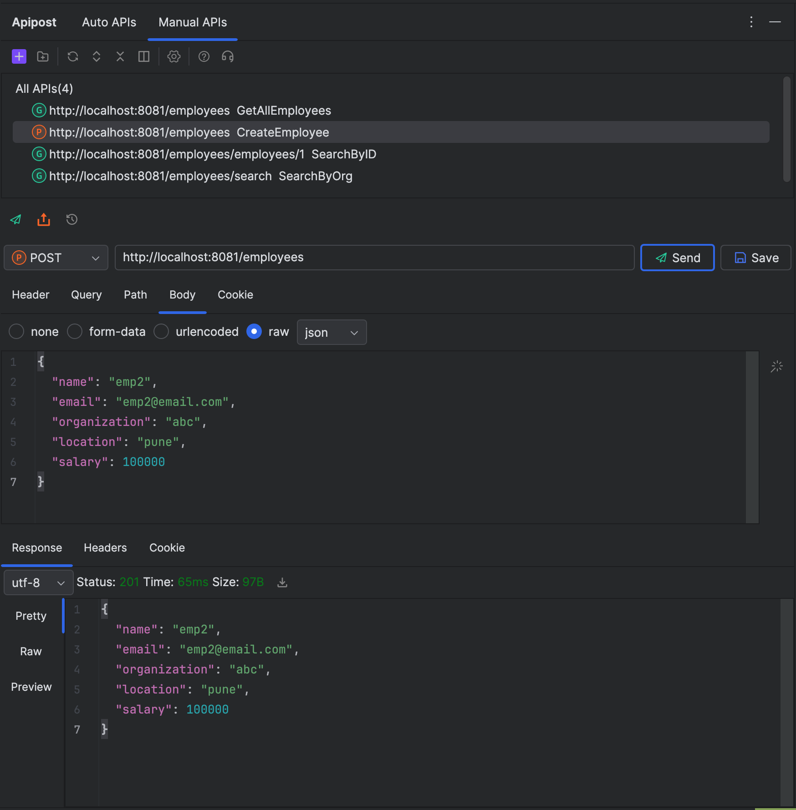
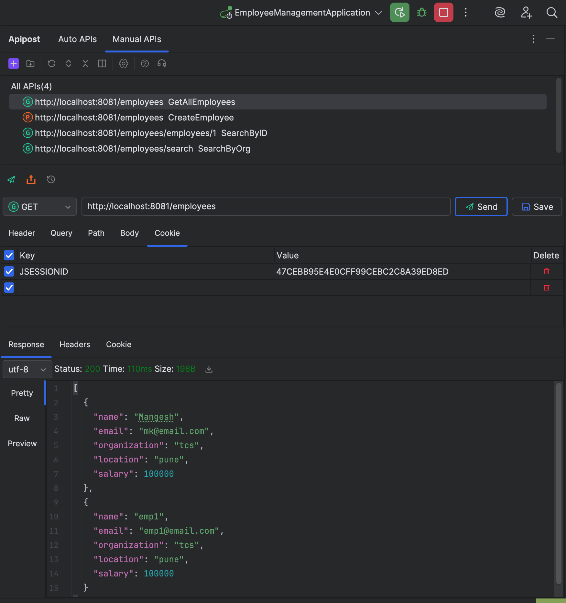
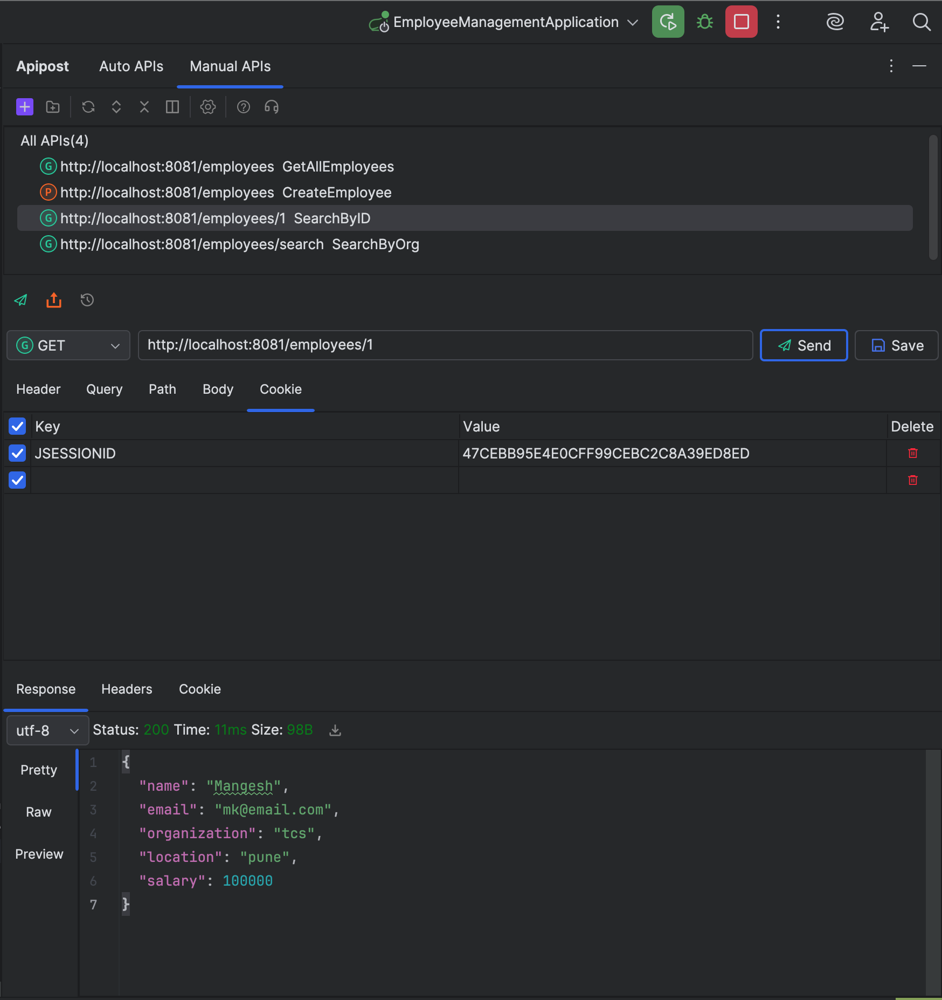
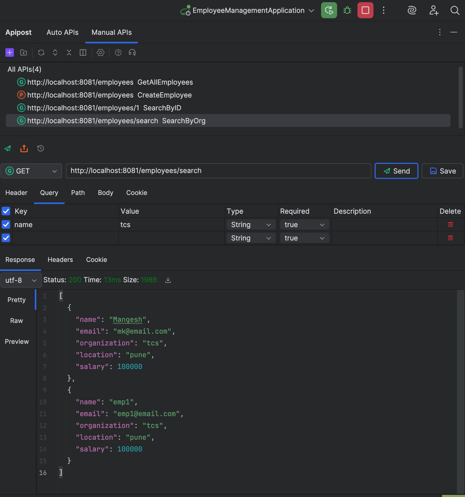

#  Employee Management API (Spring Boot)

A simple **Spring Boot REST API** for managing employees.  
This project demonstrates basic CRUD-style endpoints using **Spring Boot**, tested with **Postman**.

---

## 🚀 Features
- Create a new employee  
- Retrieve all employees  
- Find employee by ID  
- Find employees by organization  

## 🏁 Getting Started

### 1️⃣ Clone the Repository
```bash
git clone https://github.com/<your-username>/<repo-name>.git
cd <repo-name>
```

### 2️⃣ Run the Application
```bash
mvn spring-boot:run
```
> The app starts on [http://localhost:8080](http://localhost:8080)

---

## 📡 API Endpoints

| Method | Endpoint | Description |
|--------|-----------|-------------|
| **POST** | `/employees` | Create a new employee |
| **GET** | `/employees` | Retrieve all employees |
| **GET** | `/employees/{id}` | Get employee by ID |
| **GET** | `/employees/{org}` | Get employees by organization name |

---

## 🧩 1. Create Employee

### ➤ Request
**POST** `/employees/create`

```json
 {
  "name": "emp1",
  "email": "emp1@email.com",
  "organization": "abc",
  "location": "pune",
  "salary": 100000
}
```

### ✅ Response
```json
{
  "name": "emp1",
  "email": "emp1@email.com",
  "organization": "abc",
  "location": "pune",
  "salary": 100000
}
```

🖼️ **Postman Screenshot:**  


---

## 📋 2. Get All Employees

### ➤ Request
**GET** `/employees`

### ✅ Response
```json
[
  {
    "name": "Mangesh",
    "email": "mk@email.com",
    "organization": "abc",
    "location": "pune",
    "salary": 100000
  },
  {
    "name": "emp1",
    "email": "emp1@email.com",
    "organization": "abc",
    "location": "pune",
    "salary": 100000
  },
  {
    "name": "emp2",
    "email": "emp2@email.com",
    "organization": "abc",
    "location": "pune",
    "salary": 100000
  }
]
```

🖼️ **Postman Screenshot:**  


---

## 🔍 3. Find Employee by ID

### ➤ Request
**GET** `/employees/{id}`  
Example: `/employees/1`

### ✅ Response
```json
{
  "name": "Mangesh",
  "email": "mk@email.com",
  "organization": "tcs",
  "location": "pune",
  "salary": 100000
}
```

🖼️ **Postman Screenshot:**  


---

## 🏢 4. Find Employees by Organization

### ➤ Request
**GET** `/employees/org/{org}`  
Example: `/employees/org/ABC Corp`

### ✅ Response
```json
[
  {
    "name": "Mangesh",
    "email": "mk@email.com",
    "organization": "tcs",
    "location": "pune",
    "salary": 100000
  },
  {
    "name": "emp1",
    "email": "emp1@email.com",
    "organization": "tcs",
    "location": "pune",
    "salary": 100000
  }
]
```

🖼️ **Postman Screenshot:**  


---

---

## 🧾 License
This project is open source and available under the [MIT License](LICENSE).

---

### 👤 Author
**Mangesh Kokare**  
