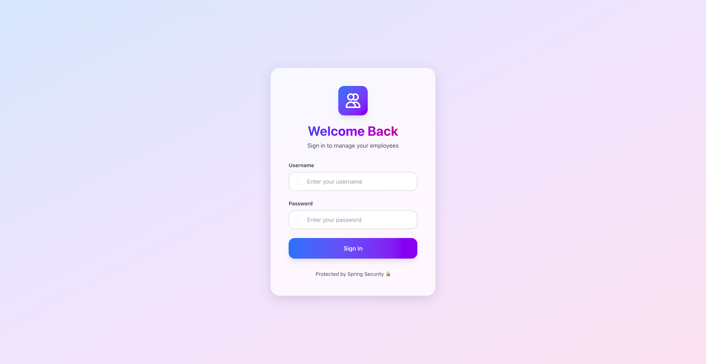
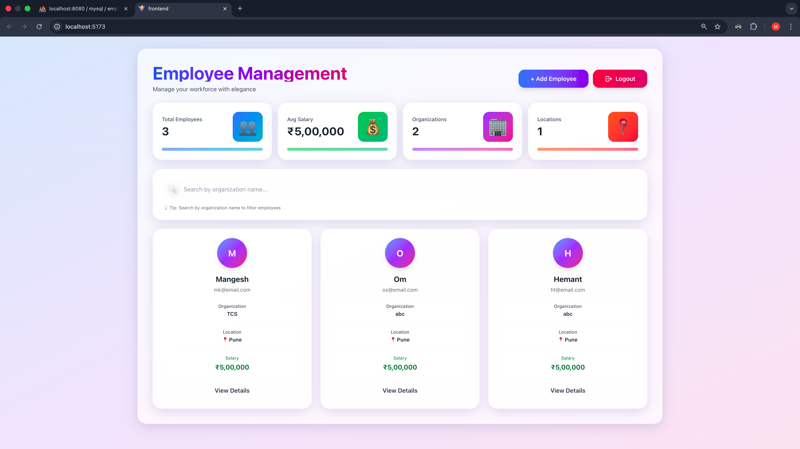
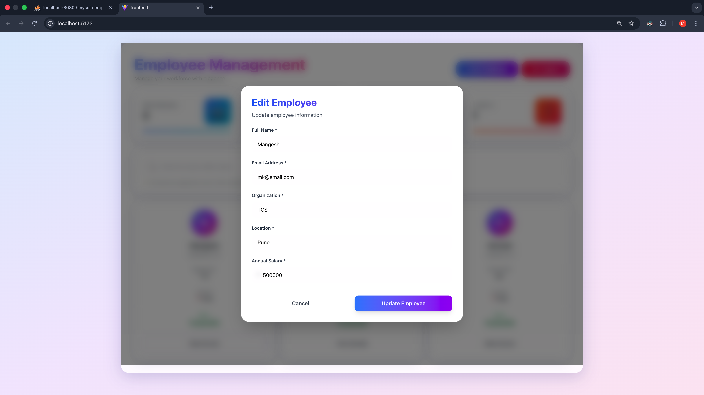

# 🏢 Employee Management System

A full-stack **Employee Management System** with **Spring Boot** backend and **React** frontend.  
This project demonstrates CRUD operations, authentication with Spring Security, and a modern glassmorphism UI.

---

## 🚀 Features

### Backend (Spring Boot)

- 🔐 JWT Authentication with Spring Security
- 👤 User management with role-based access (ADMIN/USER)
- 📋 Complete CRUD operations for employees
- 🗄️ PostgreSQL database integration
- 🔒 Secure endpoints with Spring Security
- 🌐 CORS configured for frontend integration

### Frontend (React + Vite)

- 🎨 Modern glassmorphism design with Tailwind CSS
- 🔐 Secure authentication flow
- 📊 Employee management dashboard with stats
- 🔍 Real-time search functionality
- ✨ Smooth animations and transitions
- 📱 Fully responsive design
- 🛡️ Protected routes with session management

---

## 📸 Screenshots

### Login Page



### Home Dashboard



### Employee Details



---

## 🏁 Getting Started

### Prerequisites

- Java 17+
- Node.js 16+
- PostgreSQL
- Maven

### 1️⃣ Clone the Repository

```bash
git clone https://github.com/Mangesh98/employee-management-spring-boot-poc.git
cd employee-management-spring-boot-poc
```

### 2️⃣ Backend Setup

#### Configure Database

1. Create a PostgreSQL database
2. Copy `backend/src/main/resources/application-example.properties` to `application.properties`
3. Update database credentials:

```properties
spring.datasource.url=jdbc:postgresql://localhost:5432/your_database
spring.datasource.username=your_username
spring.datasource.password=your_password
```

#### Run the Backend

```bash
cd backend
mvn spring-boot:run
```

> Backend starts on [http://localhost:8081](http://localhost:8081)

#### Test Users

Insert test users into your database:

```sql
-- Password: 'password' (BCrypt encoded)
INSERT INTO users (username, password, role, enabled)
VALUES ('admin', '$2a$10$N9qo8uLOickgx2ZMRZoMyeIjZAgcfl7p92ldGxad68LJZdL17lhWy', 'ROLE_ADMIN', true);

INSERT INTO users (username, password, role, enabled)
VALUES ('user', '$2a$10$N9qo8uLOickgx2ZMRZoMyeIjZAgcfl7p92ldGxad68LJZdL17lhWy', 'ROLE_USER', true);
```

**Login Credentials:**
| Username | Password | Role |
|----------|----------|------|
| admin | password | ROLE_ADMIN |
| user | password | ROLE_USER |

### 3️⃣ Frontend Setup

#### Install Dependencies

```bash
cd frontend
npm install
```

#### Run the Frontend

```bash
npm run dev
```

> Frontend starts on [http://localhost:5173](http://localhost:5173)

---

## 📡 API Endpoints

### Authentication

| Method   | Endpoint  | Description | Access        |
| -------- | --------- | ----------- | ------------- |
| **POST** | `/login`  | User login  | Public        |
| **POST** | `/logout` | User logout | Authenticated |

### Employee Management

| Method     | Endpoint               | Description                   | Access        |
| ---------- | ---------------------- | ----------------------------- | ------------- |
| **POST**   | `/employees`           | Create a new employee         | Authenticated |
| **GET**    | `/employees`           | Retrieve all employees        | Authenticated |
| **GET**    | `/employees/{id}`      | Get employee by ID            | Authenticated |
| **PUT**    | `/employees/{id}`      | Update employee               | Authenticated |
| **DELETE** | `/employees/{id}`      | Delete employee               | Authenticated |
| **GET**    | `/employees/org/{org}` | Get employees by organization | Authenticated |

---

## 🧩 API Examples

### 1. Login

**POST** `/login`

```
Content-Type: application/x-www-form-urlencoded

username=admin&password=password
```

### 2. Create Employee

**POST** `/employees`

```json
{
  "name": "John Doe",
  "email": "john.doe@email.com",
  "organization": "Tech Corp",
  "location": "Mumbai",
  "salary": 150000
}
```

### 3. Get All Employees

**GET** `/employees`

**Response:**

```json
[
  {
    "id": 1,
    "name": "John Doe",
    "email": "john.doe@email.com",
    "organization": "Tech Corp",
    "location": "Mumbai",
    "salary": 150000
  }
]
```

### 4. Update Employee

**PUT** `/employees/1`

```json
{
  "name": "John Doe",
  "email": "john.updated@email.com",
  "organization": "Tech Corp",
  "location": "Pune",
  "salary": 175000
}
```

### 5. Delete Employee

**DELETE** `/employees/1`

---

## 🛠️ Tech Stack

### Backend

- **Framework:** Spring Boot 3.x
- **Security:** Spring Security with form-based authentication
- **Database:** PostgreSQL
- **ORM:** Spring Data JPA
- **Build Tool:** Maven

### Frontend

- **Framework:** React 18
- **Build Tool:** Vite
- **Styling:** Tailwind CSS
- **HTTP Client:** Fetch API
- **State Management:** React Context API
- **Routing:** React Router DOM

---

## 📁 Project Structure

```
employee-management/
├── backend/                    # Spring Boot application
│   ├── src/
│   │   ├── main/
│   │   │   ├── java/
│   │   │   │   └── com/mk/Employee/Management/
│   │   │   │       ├── config/         # Security configuration
│   │   │   │       ├── controller/     # REST controllers
│   │   │   │       ├── dto/            # Data transfer objects
│   │   │   │       ├── filter/         # JWT filter
│   │   │   │       ├── model/          # Entity models
│   │   │   │       ├── repository/     # JPA repositories
│   │   │   │       ├── service/        # Business logic
│   │   │   │       └── util/           # JWT utilities
│   │   │   └── resources/
│   │   │       └── application.properties
│   │   └── test/
│   └── pom.xml
│
├── frontend/                   # React application
│   ├── src/
│   │   ├── components/         # React components
│   │   │   ├── LoginForm.jsx
│   │   │   ├── EmployeeManagement.jsx
│   │   │   ├── EmployeeCard.jsx
│   │   │   ├── EmployeeForm.jsx
│   │   │   ├── SearchBar.jsx
│   │   │   ├── StatsCard.jsx
│   │   │   └── ProtectedRoute.jsx
│   │   ├── context/            # Context providers
│   │   │   └── AuthContext.jsx
│   │   ├── App.jsx
│   │   └── main.jsx
│   ├── package.json
│   └── vite.config.js
│
└── images/                     # Screenshots
    ├── Login.png
    ├── Home.png
    └── EmployeeDetails.png
```

---

## 🔒 Security Features

- 🔐 BCrypt password encryption
- 🛡️ Session-based authentication with JSESSIONID
- 🚫 CORS protection with credentials support
- 🔑 Role-based access control (RBAC)
- 🕐 Session timeout management
- 🔒 Protected API endpoints

---

## 🎨 UI Features

- **Glassmorphism Design:** Modern, translucent card-based UI
- **Gradient Background:** Beautiful purple-to-blue gradient
- **Responsive Layout:** Works on all device sizes
- **Loading States:** Smooth loading indicators
- **Error Handling:** User-friendly error messages
- **Statistics Dashboard:** Real-time employee statistics
- **Search & Filter:** Quick employee search functionality

---

## 🚀 Deployment

### Backend (Spring Boot)

```bash
cd backend
mvn clean package
java -jar target/Employee-Management-0.0.1-SNAPSHOT.jar
```

### Frontend (React)

```bash
cd frontend
npm run build
# Deploy the 'dist' folder to your hosting service
```

---

## 📝 Environment Variables

### Backend

Configure in `application.properties`:

```properties
# Server Configuration
server.port=8081

# Database Configuration
spring.datasource.url=jdbc:postgresql://localhost:5432/employee_db
spring.datasource.username=postgres
spring.datasource.password=yourpassword

# JPA Configuration
spring.jpa.hibernate.ddl-auto=update
spring.jpa.show-sql=true

# JWT Configuration
jwt.secret=your-secret-key-here
jwt.expiration=3600000
```

### Frontend

Update API base URL in components if needed:

```javascript
const API_BASE_URL = "http://localhost:8081";
```

---

## 🧪 Testing

### Backend Tests

```bash
cd backend
mvn test
```

### Frontend Tests

```bash
cd frontend
npm test
```

---

## 📚 Additional Documentation

- [Backend API Documentation](backend/AUTH_API_DOCUMENTATION.md)
- [Frontend Auth Guide](frontend/AUTH_README.md)
- [Test Users Documentation](backend/TEST_USERS.md)

---

## 🐛 Troubleshooting

### Backend Issues

- **Port 8081 already in use:** Change port in `application.properties`
- **Database connection failed:** Check PostgreSQL is running and credentials are correct
- **Authentication fails:** Ensure test users are inserted in database

### Frontend Issues

- **CORS errors:** Verify backend CORS configuration allows `http://localhost:5173`
- **Login fails:** Check backend is running on port 8081
- **Session expired:** Increase session timeout in Spring Security config

---

## 🤝 Contributing

Contributions are welcome! Please feel free to submit a Pull Request.

1. Fork the project
2. Create your feature branch (`git checkout -b feature/AmazingFeature`)
3. Commit your changes (`git commit -m 'Add some AmazingFeature'`)
4. Push to the branch (`git push origin feature/AmazingFeature`)
5. Open a Pull Request

---

## 📄 License

This project is open source and available under the [MIT License](LICENSE).

---

## 👤 Author

**Mangesh Kokare**

- GitHub: [@Mangesh98](https://github.com/Mangesh98)
- Repository: [employee-management-spring-boot-poc](https://github.com/Mangesh98/employee-management-spring-boot-poc)

---

## 🙏 Acknowledgments

- Spring Boot Documentation
- React Documentation
- Tailwind CSS
- PostgreSQL Community

---

**⭐ If you find this project helpful, please give it a star!**
